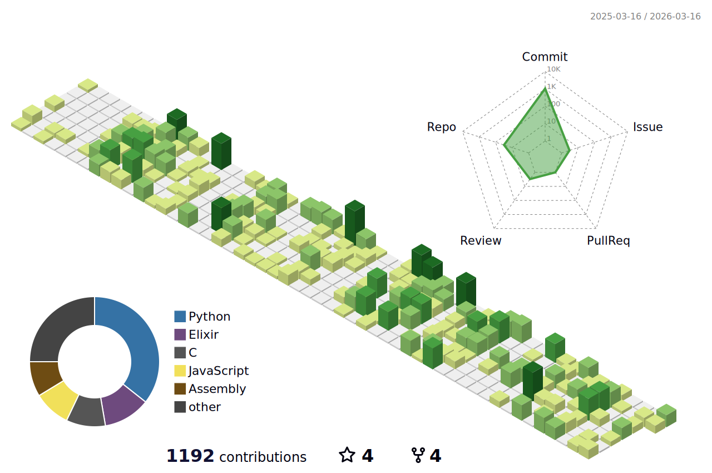

  

     I am a web and software developer and designer who enjoys creating interactive tools and interfaces. Interested in modernism, minimalism, computational graphics, machine-learning and language-learning. For several years, I have been working independently as a freelance web developer and graphic designer, specializing in user-centric design (UI/UX) and software development. I am fluent in French, English, and Portuguese.

 

 

  

## Time continues to flow, and time brings change.

  

> "It's disguised. It's camouflaged as a 1963 police telephone box. Every time the TARDIS materializes in a new location, within the first nanosecond of landing, it analyzes the surrounding environment, calculates a twelve-dimensional data map of everything within a thousand-mile radius, and then determines which outer shell would blend in best with the environment... and then it disguises itself as a 1963 police telephone box."

 

 

## 📊 Projects Overview

### Core projects

- [capitalisme-automatique_core](https://github.com/lyszt/capitalisme-automatique_core): Sequel to a java society simulator made during a Java class, but in Python

- [clairemont_core](https://github.com/lyszt/clairemont_core): 

- [dannazione-di-provvidenza_core](https://github.com/lyszt/dannazione-di-provvidenza_core): Dannazione di Providenza is an AI-powered language learning assistant with OCR capabilities, translation services, and a Firefox browser extension.

- [french-ship-madame-de-pompadour_core](https://github.com/lyszt/french-ship-madame-de-pompadour_core): Social simulation and story generator that creates sci-fi narratives based on Star Trek. OOP Python/Flask with some data structures, Gemini API, React/Vite/Tailwind frontend.

- [iris-client_core](https://github.com/lyszt/iris-client_core): Terminal User Interface made for the IRIS project manager project.

- [kyrie_core](https://github.com/lyszt/kyrie_core): 

- [providence_core](https://github.com/lyszt/providence_core): Refactored Providentia Network.

- [providentia-access_core](https://github.com/lyszt/providentia-access_core): Providentia's Password and Authentication Manager.

- [providentia-magnata_core](https://github.com/lyszt/providentia-magnata_core): Providence is a Discord bot designed to analyze user messages, manage user data, and enhance engagement through language translation and sentiment analysis.

- [ryujinni_core](https://github.com/lyszt/ryujinni_core): The Elixir version of the Clairemont bot from Discord, powered by the Providence Network (Providentia).

- [scarlett-citadel_core](https://github.com/lyszt/scarlett-citadel_core): The Scarlett Citadel. The remade version of my personal website compiled using vite into a static website. Switched for Tesserae, in fact.

- [talleyrand_core](https://github.com/lyszt/talleyrand_core): .config Linux configuration manager built in C++. 

- [tesserae_core](https://github.com/lyszt/tesserae_core): Cat-based rethought lyszt.github.io with a server for community engagement.

### Education projects

- [trabalho-ed2_edu](https://github.com/lyszt/trabalho-ed2_edu): 

- [workonomia_edu](https://github.com/lyszt/workonomia_edu): Workonomia is an economic management simulator developed in Java using the Swing library, focused on resource management and system optimization.

### Legacy projects

- [kairos-praxis_legacy](https://github.com/lyszt/kairos-praxis_legacy): Kairos Praxis (Insight 2) offers competitor analysis functionalities through a desktop application. Automated web scraping allows it to collect competitor-related data from various online resources, which can then be analyzed and compared within the tool.

- [providentia-cataclyst_legacy](https://github.com/lyszt/providentia-cataclyst_legacy): Cataclyst, the successor to the original Providentia bot, was born from the crucible of war. Providentia Type C is a relentless machine of destruction. This relentless automaton not only defends the empire but actively seeks out and obliterates its enemies. 

- [providentia-network_legacy](https://github.com/lyszt/providentia-network_legacy): Providentia Network: A Django-powered backend with a persistent database, simultaneously running Discord and Telegram bots. Integrates with external services like Google and university academic systems for advanced reasoning and actions.

- [providentia-type-d_legacy](https://github.com/lyszt/providentia-type-d_legacy): Providentia - Type D is a sophisticated Discord bot developed by the visionary minds of the Kaisaran Empire. Originally designed as a military weapon for strategic operations, this bot has undergone a transformation, evolving into a versatile automation tool and a trusted guardian for server security.

- [scarlett-dash_legacy](https://github.com/lyszt/scarlett-dash_legacy): Personal dashboard.

- [scarlett-gateway_legacy](https://github.com/lyszt/scarlett-gateway_legacy): 

  

  

### ❤️ Académie Impériale des Beaux Arts 💙
> The [*Imperial Academy*](https://github.com/lyszt/Academie-de-Lyszt) is a repository for various programming experiments and projects and where I save and register the courses I've been doing.
### Skilled in

### Also proficient in

### Design

